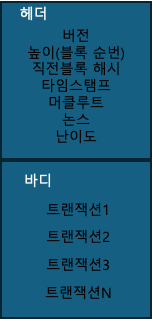
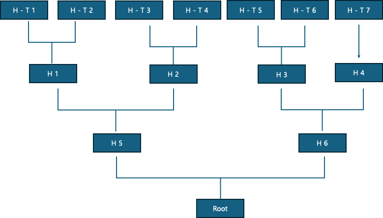

## 1. 블록 구조

### 비트코인 블록의 기본 구조를 그림으로 그리고 각 속성을 설명하시오

> 블록의 헤더 : 블록을 식별하고 연결하는 핵심데이터의 집합
- previousHash : 이전블록 해시. 직전블록과 연결하기 위한 고유값이다.
- nonce : PoW를 위해 목표해시를 맞출때까지 반복작업을 통해 갱신되는 값이다.
- timestamp : 블록이 생성된 시간이다.
- Merkle Root :  데이터 무결성을 보장하기 위한 블록 안의 모든 트랜잭션의 머클 트리 루트 해시이다.

> 블록의 바디 : 블록의 바디에는 transaction의 집합으로 구성된다
- Transaction : VIn(입력)과 Vout(출력)으로 구성된 객체로, UTXO(이전 트랜잭션의 잔액)로 구성된다.

## 2. 비트코인의 UTXO 모델.

> UTXO는 Unspent Transaction Output의 약자로 사용되지 않은 잔액을 기준으로 트랜잭션을 기준으로 관리하는 구조이다.
> 트랜잭션은 기존의 UTXO를 입력으로 사용하게되고, 트랜잭션 결과로 생성된 출력들은 새로운 UTXO를 만든다. 여기서 생성된 UTXO는 다음 트랜잭션에 사용될 수 있다. 

## 3. 트랜잭션 생성과 Output
### 여러 UTXO 입력을 사용하는 트랜잭션에서 Output의 역할을 서술하시오.

> 트랜잭션에서 UTXO상에 존재하는 여러개의 입력 잔액을 사용할 수 있으며 Vout이라는 출력 객체를 생성한다. 출력은 수신자의 address와 value를 포함하며, Vout객체의 내부에는 거스름돈을 받는 수신자의 adress가 포함될 수 있다. 여기서 생성되는 각 Output은 이후에 새로운 UTXO로 등록되어 다른 트랜잭션의 Input으로 사용될 수 있고, 잔액의 흐름을 파악할 수 있다. 

## 4. Mempool 동작 이해
### mempool에 들어갈 수 없는 트랜잭션 예시 2가지
1. 디지털 서명이 정상적이지 않은 경우
2. Double spending

### 채굴자가 블록에 트랜잭션으로 선택할 때의 기준을 서술
- 수수료(fee)가 높은 순서대로 선택한다.

## 5. 마이닝 과정
### 작업증명을 포함한 채굴자의 블록 생성 과정을 Nonce, Hash, Difficulty 중심으로 설명

> 채굴자는 블록의 헤더 정보를 기반으로 블록의 해시가 특정 Difficulty 이하의 값이 되도록 하기 위해 Nonce값을 계속적으로 변경하는 작엄증명을 수행하고, 조건에 맞는 해시값을 찾게되면 해당 블록은 대기상태에서 유효한 블록으로 인정된다. 유효한 블록으로 인정된 채굴자는 트랜잭션 수수료와 비트코인을 획득하게 된다. 블록의 난이도는 자동 조절되어 블록 생성 속도를 좌우하게 되며 채굴속도는 약 10~15분으로 제한되어있다. 

## 6. 트랜잭션 구조와 수수료
### Input, Output의 역할과 수수료가 발생하는 이유.

- Input의 역할 : 이전 트랜잭션의 사용되지 않은 출력을 참조하여 객체 구성
- Output의 역할 : 송금할 대상의 address와 value(금액)을 정의한 객체 구성
- 수수료가 발생하는 이유 : (총 Input) - (총 Output) 으로 계산되며, 이는 UTXO상의 송금하고자하는 금액과 잔액의 총합이 fit하게 떨어지지않을 경우 잔액의 차이로 발생하는 것이다. 

## 7. PoW와 난이도 조절
>PoW는 채굴자들이 해시 계산을 통해 가장 먼저 조건을 만족하는 블록을 찾아 증명함으로써 블록의 무결성을 증명하고, 이를 체인에 연결하도록 합의하는 과정이다. 이 과정은 네트워크 내 아무나 참여할 수 있어 탈중앙적인 구조를 유지하며, 장부가 모두에게 공개되어 있어 쉽게 블록을 조작할 수 없다는 장점이 있다. PoW의 난이도는 2016개 블록마다 자동 조정되며, 블록 생성 속도를 10~15분으로 유지하여 보안성을 높인다.

## 8. 머클 트리의 역할
### Merkle Tree를 사용하는 이유와 장점
> 머클 트리는 트랜잭션 데이터를 해시값으로 정리해 binary 트리 형태로 만드는 구조이다. 가장 가까운 트랜잭션과 해시화 하는 과정을 통해 루트 노드에는 모든 트랜잭션 정보를 대표할 수 있는 해시값인 머클 루트(Merkle Root)가 생성된다.

### Merkle Tree 그림과 함께 설명

블록 바디의 트랜잭션들 (예를들어 7개의 트랜잭션)을 해시화하여 나열한다(H - T1 ~ H - T2). 인접한 두 해시화된 노드끼리 해시화하여 상위 노드를 만든다. 이때 해시화된 노드가 홀수라면 해당 노드는 그대로 다시한번 해시화되어 상위노드로 올라간다(H1 ~ H4). 인접 노드와 해시화하는 것을 반복한다(H5~H6). 최종적으로 하나의 해시화된 노드가 도출되면 그것이 루트 노드이다. 이러한 과정은 트랜잭션의 무결성을 보장하기 위한 과정이다.

## 9. 트랜잭션 검증 절차
### 트랜잭션을 유효하다고 판단하기 위한 검증과 그 이유
>트랜잭션이 유효하다고 판단되기 위해서는 디지털 서명 검증을 통해 실제 트랜잭션 소유자가 서명했는지 확인하고 입력으로 사용된 UTXO가 이미 사용되지 않았는지 확인하여 Double spending을 방지해야 한다. 또한 입력 금액이 출력 금액보다 크거나 같아야 한다.

## 10. UTXO 기반 잔액 계산
### 지갑의 잔액을 어떻게 계산하는지 UTXO 관점에서 서술
UTXO에서 지갑의 잔액은 해당 주소가 소유한 사용되지 않은 출력의 합으로 계산된다. 예를 들어, A는 총 1.4BTC의 UTXO(0.3, 0.5, 0.6)를 보유하고 있으며, 이 중 0.3과 0.5BTC를 사용해 B에게 0.7BTC를 송금하고, 나머지 0.1BTC는 거스름돈으로 자신에게 돌려주는 트랜잭션을 생성한다고 가정해보면, 이 트랜잭션이 발생할 경우 사용된 두 개의 입력(0.3, 0.5)은 A의 UTXO 목록에서 제거되고, 새로운 출력인 0.1BTC가 A의 새 UTXO로 추가된다. B는 0.7BTC를 받으며 새로운 UTXO로 등록되고, 트랜잭션 이후 A의 잔액은 남은 0.6BTC와 새로 생성된 0.1BTC의 합인 0.7BTC, B의 잔액은 0.7BTC가 된다.